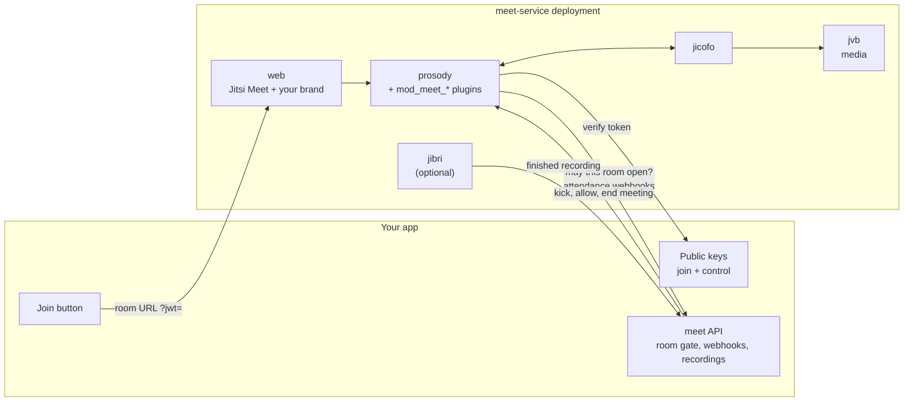

# meet-service

[](https://github.com/nowshad7/meet-service/actions/workflows/ci.yml)
[](LICENSE)
[](https://github.com/jitsi/docker-jitsi-meet/releases/tag/stable-11146-2)

Self-hosted video meetings for your app, shipped as Docker images built on the official, unmodified Jitsi Meet images.

meet-service adds what an application needs on top of Jitsi Meet: signed join links, an approval call before a room opens, attendance webhooks, moderator controls, privacy mode, one seat per user and recording hand-off.
You run it like any other dependency: pull `ghcr.io/nowshad7/meet-<service>:<version>`, keep a compose file and your settings, bump one version to upgrade.
Your LMS, telehealth portal, community platform or internal tool integrates through a small, versioned [app contract](contract/README.md), in any language.

## Why

- **No fork.**
  Each image is a thin layer on the official Jitsi image of the pinned release: it only adds the plugins, config defaults, brand and scripts, and patches nothing upstream.
  The same files can also be mounted into the stock Jitsi images from a checkout of this repository.
- **Versioned like a dependency.**
  Every release publishes six images under one version.
  A server needs a compose file, its settings and secrets: upgrading is bumping `MEET_VERSION`, rolling back is setting it back.
- **Settings-only multi-tenant.**
  Every deployment is one folder of settings and branding.
  Run as many separate deployments as you need from the same images, never a per-customer branch.
- **A versioned app contract.**
  JSON schemas, examples and a runnable reference app describe exactly what your app signs, answers and receives.
- **Upgrade-safe.**
  One file pins the Jitsi release, and `scripts/meet upgrade <tag>` reports every upstream change that can affect you before it is bumped.
  Each release bakes that pin into its images, so a deployment never mixes Jitsi versions.

## Images

| Image | Built on | Adds |
|---|---|---|
| `ghcr.io/nowshad7/meet-prosody` | `ghcr.io/jitsi/prosody` | The `mod_meet_*` plugins and the Prosody config fragments |
| `ghcr.io/nowshad7/meet-web` | `ghcr.io/jitsi/web` | Web config defaults, nginx additions, the default brand and the landing page |
| `ghcr.io/nowshad7/meet-jicofo` | `ghcr.io/jitsi/jicofo` | Jicofo's REST API switched on, for health checks |
| `ghcr.io/nowshad7/meet-jvb` | `ghcr.io/jitsi/jvb` | Nothing; published so one version pins every service |
| `ghcr.io/nowshad7/meet-jibri` | `ghcr.io/jitsi/jibri` | The script that uploads finished recordings to your app |
| `ghcr.io/nowshad7/meet-app-proxy` | `nginx:alpine` | A proxy to an app running on the same docker host |

- **Versions.**
  A release tag `vX.Y.Z` publishes every image as `X.Y.Z` and `latest`, for `linux/amd64` and `linux/arm64`, all built on the same Jitsi release (see [UPSTREAM_VERSION](UPSTREAM_VERSION)).
- **Pinning.**
  A deployment sets `MEET_VERSION=X.Y.Z` once and every service follows it; never run `latest` in production.
- **Availability.**
  The images appear on GHCR with the first release tag, `v1.0.0`.
  Until it is published, build them locally as described in [docs/upgrade.md](docs/upgrade.md#cutting-a-release), or [develop from a checkout](#develop-from-a-checkout).

## Quick start (localhost, published images)

You need Docker with Compose v2, curl and openssl, and the ports 8000, 8443, 3000, 5280, 8080, 8888 (TCP) and 10000 (UDP) free.
This runs release `1.0.0` together with the [reference app](examples/app-node/README.md), which plays the part of your application.

1. Fetch the deployment template and the reference app from the release:

   ```bash
   mkdir meet-local && cd meet-local
   base=https://raw.githubusercontent.com/nowshad7/meet-service/v1.0.0
   curl -fsSL -O "$base/deploy/compose.yml" -O "$base/deploy/secrets.env.example"
   curl -fsSL --create-dirs -o app/app.mjs "$base/examples/app-node/app.mjs" \
     -o app/server.mjs "$base/examples/app-node/server.mjs"
   ```

2. Write the localhost settings, with every plugin switched on:

   ```bash
   cat > .env <<'EOF'
   COMPOSE_PROJECT_NAME=meet-local
   MEET_VERSION=1.0.0
   PUBLIC_URL=https://localhost:8443
   HTTP_PORT=8000
   HTTPS_PORT=8443
   ENABLE_HSTS=0
   JVB_ADVERTISE_IPS=127.0.0.1
   JVB_DISABLE_STUN=1
   ENABLE_P2P=0
   ENABLE_AUTH=1
   ENABLE_GUESTS=0
   AUTH_TYPE=jwt
   JWT_APP_ID=example-app
   JWT_ALLOW_EMPTY=0
   DYNAMIC_BRANDING_URL=/static/brand/branding.json
   MEET_PLUGINS=events,room-gate,control,single-session,privacy
   MEET_APP_API_URL=http://app:3000/meet/api
   MEET_APP_KEYS_URL=http://app:3000/meet/keys
   MEET_APP_CONTROL_KEYS_URL=http://app:3000/meet/control-keys
   MEET_EVENTS=1
   PROSODY_RESERVATION_ENABLED=1
   PROSODY_RESERVATION_REST_BASE_URL=${MEET_APP_API_URL}
   XMPP_MODULES=muc_size,persistent_lobby,muc_end_meeting,meet_control
   XMPP_MUC_MODULES=token_affiliation,token_lobby_bypass,token_lobby_autostart,meet_single_session,meet_privacy
   JWT_ASAP_KEYSERVER=${MEET_APP_KEYS_URL}
   XMPP_MUC_CONFIGURATION="app_id = \"${JWT_APP_ID}\",asap_key_server = \"${MEET_APP_KEYS_URL}\",token_verification_allowlist = { \"hidden.meet.jitsi\" }"
   EOF
   ```

3. Add the reference app next to Jitsi; Compose reads `compose.override.yml` automatically:

   ```bash
   cat > compose.override.yml <<'EOF'
   services:
     app:
       image: node:22-alpine
       command: ["node", "/app/server.mjs"]
       env_file: [.env, secrets.env]
       environment:
         - MEET_CONTROL_URL=http://prosody:5280
       volumes:
         - ./app:/app:ro
       ports:
         - "127.0.0.1:3000:3000"
       networks:
         meet.jitsi:
   EOF
   ```

4. Generate the secrets, create the data tree for the user the images run as (uid 1000) and start:

   ```bash
   while IFS= read -r line; do [[ $line == *= ]] && line+=$(openssl rand -hex 24); echo "$line"; done \
     <secrets.env.example >secrets.env && chmod 600 secrets.env
   mkdir -p data/{web,jicofo,jvb,jibri} data/prosody/{config,prosody-plugins-custom} \
     data/storage/{web,prosody,transcripts,jibri/logs,jibri/recordings} data/tmp/web-load-test
   sudo chown -R 1000:1000 data
   docker compose up -d
   docker compose ps
   ```

Then try it:

1. Open <http://localhost:3000> and press **Join**.
   The app signs a join token and sends you to `https://localhost:8443/acme/<room>`.
   Accept the self-signed certificate warning once.
2. Open <http://localhost:3000> in a second browser with another user id and join the same room as a participant.
3. Watch the room gate approval and the attendance webhooks arrive at <http://localhost:3000/events>.
4. Remove the participant, let them back and end the meeting with control calls signed by the app's control key:

   ```bash
   curl -X POST "http://localhost:3000/control/kick-user?room=<room>&user=<user id>"
   curl -X POST "http://localhost:3000/control/allow-user?room=<room>&user=<user id>"
   curl -X POST "http://localhost:3000/control/end-meeting?room=<room>"
   ```

Stop it with `docker compose down`.
From any checkout of this repository, `tests/stack-check.sh --dir /path/to/meet-local` checks that every plugin is loaded and answering.

## Architecture



Read [docs/architecture.md](docs/architecture.md) for the join flow, the two gates and the trust boundaries.

## Features

| Feature | Switch | What your app gets |
|---|---|---|
| [Join tokens](contract/README.md#1-join-token) | always, with `AUTH_TYPE=jwt` | RS256 tokens bound to one room, one tenant and one user id |
| [Room gate](docs/features/room-gate.md) | `MEET_PLUGINS=room-gate` | Your app approves or refuses every room before it opens |
| [Events](docs/features/events.md) | `MEET_PLUGINS=events` | Server-side attendance: room and participant webhooks |
| [Control](docs/features/control.md) | `MEET_PLUGINS=control` | Remove a user (with ban), let them back, end a meeting |
| [Privacy](docs/features/privacy.md) | `MEET_PLUGINS=privacy` | Participants muted until approved, chat to moderators only |
| [Single session](docs/features/single-session.md) | `MEET_PLUGINS=single-session` | One seat per user across tabs and devices |
| [Recording](docs/features/recording.md) | `MEET_FEATURES=recording` | Jibri recordings uploaded to your app with retries |
| [App proxy](docs/features/app-proxy.md) | `MEET_FEATURES=app-proxy` | Reach an app that runs on the same docker host |
| Branding and wording | `brand/` in the deployment folder, `MEET_TEXT_*` | Your logo, colours, page titles and notices |

## Integrate your app

Your app implements up to four things, all described in [contract/README.md](contract/README.md) with JSON schemas and examples:

1. **Sign a join token** (RS256 JWT) per user and room, and publish the public key.
2. **Answer the room gate**, if enabled: approve or refuse a room before it opens.
3. **Receive webhooks**: room created and destroyed, participant joined and left, recording uploaded.
4. **Make control calls** with a token signed by a separate control key: kick, allow back, end meeting.

[examples/app-node](examples/app-node/README.md) does all four in about 300 lines of dependency-free Node.js, and `tests/run.sh` validates its payloads against the contract schemas.

## Deploy to production

A production deployment is the same folder with production settings: a domain, TLS, your app's URLs and the plugins you use.

```bash
mkdir acme && cd acme                     # your deployment folder, ideally in a private repository
base=https://raw.githubusercontent.com/nowshad7/meet-service/v1.0.0/deploy
curl -fsSL -O "$base/compose.yml" -O "$base/secrets.env.example"
curl -fsSL "$base/env.example" -o .env    # set MEET_VERSION, domain, TLS, app URLs, plugins
docker compose up -d                      # after generating secrets.env and the data tree
```

[docs/deploy.md](docs/deploy.md#deploy-from-published-images) walks through it, including the settings for each plugin, branding, the landing page and language strings.
It also covers TLS (Let's Encrypt or your own certificate), firewall ports and exposing the control port to an app on another host.
[docs/operations.md](docs/operations.md) covers health, logs, backups and recordings.

## Develop from a checkout

To work on the plugins, scripts or web defaults, run the stock Jitsi images with this repository's files mounted in, through `scripts/meet`.
You need Docker with Compose v2, git, openssl and bash.

```bash
git clone https://github.com/nowshad7/meet-service.git
cd meet-service
scripts/meet init example     # generates secrets, creates .data/example, fetches docker-jitsi-meet
scripts/meet up example       # starts Jitsi and the reference app on the same ports as the quick start
scripts/meet health example   # run again if a service is still starting
tests/stack-check.sh example  # every plugin loaded and answering
scripts/meet down example
```

A deployment of your own runs the same way:

```bash
scripts/meet new-deployment acme          # copies deployments/_template
$EDITOR deployments/acme/deployment.env   # domain, TLS, app URLs, plugins
scripts/meet init acme && scripts/meet up acme
scripts/meet health acme && tests/stack-check.sh acme
```

`scripts/meet` derives the plugin settings from `MEET_PLUGINS`, and `scripts/meet env <name>` prints them, which is the quickest way to move a deployment to the images.
[deployments/example-production](deployments/example-production/deployment.env) shows a complete production setting with a domain and Let's Encrypt.
Keep real deployments outside this repository by pointing `MEET_DEPLOYMENTS_DIR` at a private folder or repository; only `_template` and the shipped examples are tracked here.
`tests/run.sh` runs the unit, script and contract tests, and `docker buildx bake` builds the images (see [docs/upgrade.md](docs/upgrade.md#cutting-a-release)).

## Upgrading Jitsi

```bash
scripts/meet upgrade-check            # newer upstream stable releases
scripts/meet upgrade stable-NNNNN     # report what changed upstream, then pin it
tests/run.sh                          # then bring up staging and run tests/stack-check.sh
```

The report lists added and removed environment variables, Jicofo and Prosody template changes and changes to the upstream Prosody modules the plugins depend on.
A release tag `vX.Y.Z` then publishes the images; deployments on published images upgrade by setting `MEET_VERSION=X.Y.Z` and running `docker compose up -d`, and roll back the same way.
See [docs/upgrade.md](docs/upgrade.md), including [how to cut a release](docs/upgrade.md#cutting-a-release).

## Scaling

- **Media:** one JVB serves many meetings; add bridges with upstream's [scaling guide](https://jitsi.github.io/handbook/docs/devops-guide/devops-guide-scalable) when CPU or bandwidth runs out.
  Bandwidth, not CPU, is usually the first limit, so measure it under a real meeting before you size hosts.
- **Recording:** one Jibri records one meeting at a time and needs about 2 to 3 GB of RAM, so run one Jibri per concurrent recording: `docker compose up -d --scale jibri=N` (`scripts/meet up <name> --scale jibri=N` from a checkout).
- **Signalling:** each deployment has one Prosody and one Jicofo; give a very large tenant its own deployment rather than growing one.

## Project layout

| Path | Contents |
|---|---|
| `UPSTREAM_VERSION` | The pinned `docker-jitsi-meet` release; images and upstream compose files use the same tag |
| `prosody/plugins/` | The Prosody plugins (`mod_meet_*`) |
| `prosody/conf.d/` | Prosody config fragments; every secret and per-deployment value comes from the environment |
| `compose/` | Compose override for every checkout deployment plus one file per optional feature |
| `images/`, `docker-bake.hcl` | The release images: one Dockerfile target per service, built on the pinned upstream images |
| `deploy/` | Template folder for a deployment on published images: `compose.yml`, `env.example`, `secrets.env.example`, `brand/` |
| `services/` | Recording finalize script and the optional app proxy |
| `web/` | Default web config, landing page, close page and brand |
| `deployments/` | `_template`, the localhost `example` and `example-production`; your own deployments live here or in `MEET_DEPLOYMENTS_DIR` |
| `contract/` | App contract v1: README, JSON schemas, examples |
| `examples/app-node/` | Reference app integration |
| `scripts/meet` | `new-deployment`, `init`, `up`, `down`, `health`, `logs`, `env`, `compose`, `upgrade-check`, `upgrade` |
| `tests/` | Plugin unit tests, script tests, contract check and the live stack check |
| `docs/` | Architecture, deployment, operations, upgrades and one page per feature |

## FAQ

**How does this code bind to the official Jitsi images without forking them?**
Three upstream extension points, nothing else.
The plugins are mounted read-only into `/prosody-plugins-custom`, a volume the upstream Prosody image declares and lists first in `plugin_paths`.
They are switched on with the upstream environment variables `XMPP_MODULES` and `XMPP_MUC_MODULES`, which `scripts/meet` derives from `MEET_PLUGINS`.
Their settings come from fragments mounted into `/config/conf.d/`, which the upstream Prosody config pulls in with `Include "conf.d/*.cfg.lua"`; the fragments read secrets with `os.getenv`, so nothing secret is written into a file.
Web branding and config use the upstream `custom-config.js`, `custom-interface_config.js`, `plugin.head.html` and `nginx-custom` hooks the same way.
`scripts/meet env <name>` prints exactly which compose files and derived settings a deployment gets.
The release images put the same files in the same places at build time instead of mounting them: the plugins go into upstream's `/prosody-plugins/`, and a start-up step copies the config defaults where the upstream start-up scripts read `/config` overrides from.

**Can I use it without JWT, room gate or webhooks?**
Yes.
Every plugin and feature is opt-in per deployment, and anything you leave out is plain upstream Jitsi behaviour.

**Does it work with Jitsi as a Service, Kubernetes or Helm?**
It targets `docker-jitsi-meet` with Docker Compose.
The release images take the same environment variables as the upstream ones, so they can replace them in other setups, but only Compose is tested here.

**Why is the control key separate from the join key?**
A user can read their own join token from the browser.
If the same key also authorised kick and end-meeting calls, any user could remove anyone.
See [docs/architecture.md](docs/architecture.md#why-a-separate-control-key).

**Where do my deployments live?**
On published images, each deployment is its own folder anywhere, for example in a private repository, holding `compose.yml`, `.env` and `brand/`.
On a checkout, in `deployments/<name>/` (gitignored) or in any folder you point `MEET_DEPLOYMENTS_DIR` at.
Secrets stay in `secrets.env` next to the settings and are always gitignored.

## Contributing

Issues and pull requests are welcome.
Read [CONTRIBUTING.md](CONTRIBUTING.md), run `tests/run.sh` before you push, and use conventional commit messages.
Report security problems privately as described in [SECURITY.md](SECURITY.md).
This project follows the [Contributor Covenant](CODE_OF_CONDUCT.md).

## License

[Apache-2.0](LICENSE), the same license as Jitsi Meet.
`mod_meet_events` is adapted from `mod_event_sync_component` in [jitsi-contrib/prosody-plugins](https://github.com/jitsi-contrib/prosody-plugins); see [NOTICE](NOTICE).
Jitsi and Jitsi Meet are projects of 8x8, Inc. and the Jitsi community; this project is not affiliated with them.
