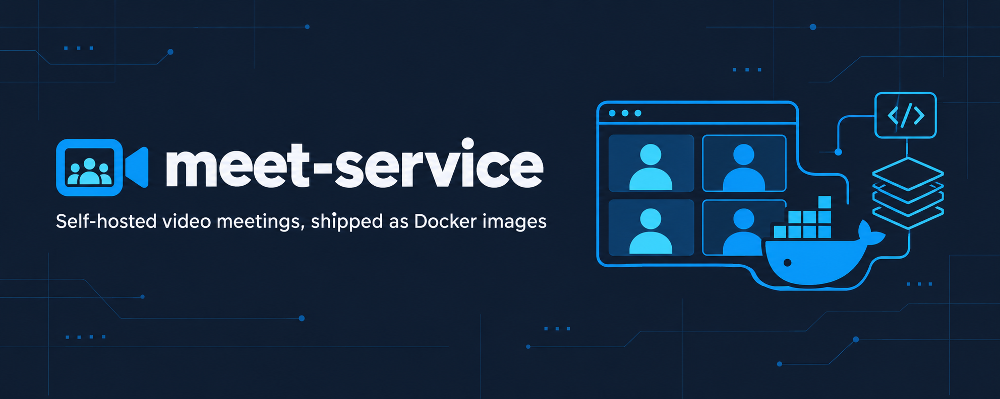

<p align="center"></p>

# meet-service

[](https://github.com/nowshad7/meet-service/actions/workflows/ci.yml)
[](LICENSE)
[](https://github.com/jitsi/docker-jitsi-meet/releases/tag/stable-11146-2)

Self-hosted video meetings for your app, shipped as Docker images built on the official, unmodified Jitsi Meet images.
meet-service adds what an application needs on top of Jitsi Meet: signed join links, an approval call before a room opens, attendance webhooks, moderator controls, privacy mode, one seat per user and recording hand-off.
You run it like any other dependency through a small, versioned [app contract](contract/README.md), in any language.

## Using the published Docker images

Every release publishes six images under one version, all built on the same pinned Jitsi release (see [UPSTREAM_VERSION](UPSTREAM_VERSION)).
Pull them as `ghcr.io/nowshad7/meet-<service>:<version>`.

| Image | Built on | Adds |
|---|---|---|
| `ghcr.io/nowshad7/meet-prosody` | `ghcr.io/jitsi/prosody` | The `mod_meet_*` plugins and the Prosody config fragments |
| `ghcr.io/nowshad7/meet-web` | `ghcr.io/jitsi/web` | Web config defaults, nginx additions, the default brand and the landing page |
| `ghcr.io/nowshad7/meet-jicofo` | `ghcr.io/jitsi/jicofo` | Jicofo's REST API switched on, for health checks |
| `ghcr.io/nowshad7/meet-jvb` | `ghcr.io/jitsi/jvb` | Nothing; published so one version pins every service |
| `ghcr.io/nowshad7/meet-jibri` | `ghcr.io/jitsi/jibri` | The script that uploads finished recordings to your app |
| `ghcr.io/nowshad7/meet-app-proxy` | `nginx:alpine` | A proxy to an app running on the same docker host |

- **Versions.** A release tag `vX.Y.Z` publishes every image as `X.Y.Z` and `latest`, for `linux/amd64` and `linux/arm64`.
- **Pinning.** A deployment sets `MEET_VERSION=X.Y.Z` once in its `.env` and every service follows it.
  Upgrading is bumping `MEET_VERSION` and running `docker compose up -d`; rolling back is setting it back.
  Never run `latest` in production.

The images appear on GHCR with the first release tag, `v1.0.0`.
See [docs/upgrade.md](docs/upgrade.md) for how upstream Jitsi releases are pinned and cut into image versions.

## Adopter deployment structure

A deployment is one folder of settings and branding on top of the published images.
You keep this folder, ideally in a private repository; you do not fork or branch this project per customer.
Run as many separate deployments as you need from the same images - multi-tenant by settings, never by branch.

```
acme/                     # one folder per deployment, yours to keep
  compose.yml             # from deploy/compose.yml, unchanged
  .env                    # settings: MEET_VERSION, domain, TLS, app URLs, MEET_PLUGINS
  secrets.env             # generated secrets, gitignored (chmod 600)
  brand/                  # your logo, colours and branding.json
  data/                   # runtime data tree, created on first start
```

Fetch the template for a new deployment from a release:

```bash
mkdir acme && cd acme
base=https://raw.githubusercontent.com/nowshad7/meet-service/v1.0.0/deploy
curl -fsSL -O "$base/compose.yml" -O "$base/secrets.env.example"
curl -fsSL "$base/env.example" -o .env    # set MEET_VERSION, domain, TLS, app URLs, plugins
```

`compose.yml` is used as shipped; everything that differs between deployments lives in `.env`, `secrets.env` and `brand/`.
Secrets stay in `secrets.env` next to the settings and are always gitignored.
Your app integrates through the versioned [app contract](contract/README.md): sign join tokens, answer the room gate, receive webhooks and make control calls, in any language.

## Enabling features

Every feature is opt-in per deployment through `.env`; anything you leave out is plain upstream Jitsi behaviour.
Set the switch shown below, then `docker compose up -d`.

| Feature | Switch in `.env` | What your app gets |
|---|---|---|
| [Join tokens](contract/README.md#1-join-token) | `AUTH_TYPE=jwt` | RS256 tokens bound to one room, one tenant and one user id |
| [Room gate](docs/features/room-gate.md) | `MEET_PLUGINS=room-gate` | Your app approves or refuses every room before it opens |
| [Events](docs/features/events.md) | `MEET_PLUGINS=events` | Server-side attendance: room and participant webhooks |
| [Control](docs/features/control.md) | `MEET_PLUGINS=control` | Remove a user (with ban), let them back, end a meeting |
| [Privacy](docs/features/privacy.md) | `MEET_PLUGINS=privacy` | Participants muted until approved, chat to moderators only |
| [Single session](docs/features/single-session.md) | `MEET_PLUGINS=single-session` | One seat per user across tabs and devices |
| [Recording](docs/features/recording.md) | `MEET_FEATURES=recording` | Jibri recordings uploaded to your app with retries |
| [Transcription pilot](docs/features/transcription.md) | `MEET_FEATURES=transcription` with a private Whisper URL | Legacy Jigasi live captions; Bangla recognition unverified |
| [App proxy](docs/features/app-proxy.md) | `MEET_FEATURES=app-proxy` | Reach an app that runs on the same docker host |
| Branding and wording | `brand/` in the deployment folder, `MEET_TEXT_*` | Your logo, colours, page titles and notices |

`MEET_PLUGINS` takes a comma-separated list, so combine the plugins you want (for example `MEET_PLUGINS=events,control,single-session,privacy`).
Each linked page lists the exact settings that plugin reads.
