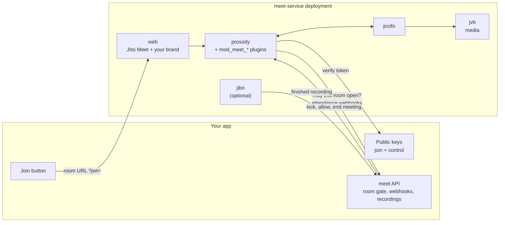

# meet-service

[](https://github.com/nowshad7/meet-service/actions/workflows/ci.yml)
[](LICENSE)
[](https://github.com/jitsi/docker-jitsi-meet/releases/tag/stable-11146-2)

Self-hosted video meetings for your app, built on the official, unmodified Jitsi Meet images.

meet-service adds what an application needs on top of Jitsi Meet: signed join links, an approval call before a room opens, attendance webhooks, moderator controls, privacy mode, one seat per user and recording hand-off.
Your LMS, telehealth portal, community platform or internal tool integrates through a small, versioned [app contract](contract/README.md), in any language.

## Why

- **No fork.**
  Upstream images and compose files run exactly as Jitsi ships them.
  This repository only mounts plugins, config fragments and scripts into them.
- **Settings-only multi-tenant.**
  Every deployment is one folder of settings and branding.
  Run as many separate deployments as you need from the same code, never a per-customer branch.
- **A versioned app contract.**
  JSON schemas, examples and a runnable reference app describe exactly what your app signs, answers and receives.
- **Upgrade-safe.**
  One file pins the Jitsi release, and `scripts/meet upgrade <tag>` reports every upstream change that can affect you before you bump it.

## Architecture



Read [docs/architecture.md](docs/architecture.md) for the join flow, the two gates and the trust boundaries.

## Features

| Feature | Switch | What your app gets |
|---|---|---|
| [Join tokens](contract/README.md#1-join-token) | always, with `AUTH_TYPE=jwt` | RS256 tokens bound to one room, one tenant and one user id |
| [Room gate](docs/features/room-gate.md) | `MEET_PLUGINS=room-gate` | Your app approves or refuses every room before it opens |
| [Events](docs/features/events.md) | `MEET_PLUGINS=events` | Server-side attendance: room and participant webhooks |
| [Control](docs/features/control.md) | `MEET_PLUGINS=control` | Remove a user (with ban), let them back, end a meeting |
| [Privacy](docs/features/privacy.md) | `MEET_PLUGINS=privacy` | Participants muted until approved, chat to moderators only |
| [Single session](docs/features/single-session.md) | `MEET_PLUGINS=single-session` | One seat per user across tabs and devices |
| [Recording](docs/features/recording.md) | `MEET_FEATURES=recording` | Jibri recordings uploaded to your app with retries |
| [App proxy](docs/features/app-proxy.md) | `MEET_FEATURES=app-proxy` | Reach an app that runs on the same docker host |
| Branding and wording | `deployments/<name>/brand/`, `MEET_TEXT_*` | Your logo, colours, page titles and notices |

## Quick start (5 minutes, localhost)

You need Docker with Compose v2, git, openssl and bash, and the ports 8000, 8443, 3000, 5280, 8080, 8888 (TCP) and 10000 (UDP) free.

```bash
git clone https://github.com/nowshad7/meet-service.git
cd meet-service
scripts/meet init example     # generates secrets, creates .data/example, fetches docker-jitsi-meet
scripts/meet up example       # starts Jitsi and the reference app
scripts/meet health example   # run again if a service is still starting
```

1. Open <http://localhost:3000>, the [reference app](examples/app-node/README.md).
2. Press **Join**.
   The app signs a join token and sends you to `https://localhost:8443/acme/<room>`.
   Accept the self-signed certificate warning once.
3. Open <http://localhost:3000> in a second browser with another user id and join the same room as a participant.
4. Watch the room gate approval and the attendance webhooks arrive at <http://localhost:3000/events>.
5. Remove the participant from the meeting with a control call signed by the app's control key:

   ```bash
   curl -X POST "http://localhost:3000/control/kick-user?room=<room>&user=<user id>"
   curl -X POST "http://localhost:3000/control/allow-user?room=<room>&user=<user id>"
   curl -X POST "http://localhost:3000/control/end-meeting?room=<room>"
   ```

Stop it with `scripts/meet down example`.
`tests/stack-check.sh example` checks that every plugin is loaded and answering.

## Integrate your app

Your app implements up to four things, all described in [contract/README.md](contract/README.md) with JSON schemas and examples:

1. **Sign a join token** (RS256 JWT) per user and room, and publish the public key.
2. **Answer the room gate**, if enabled: approve or refuse a room before it opens.
3. **Receive webhooks**: room created and destroyed, participant joined and left, recording uploaded.
4. **Make control calls** with a token signed by a separate control key: kick, allow back, end meeting.

[examples/app-node](examples/app-node/README.md) does all four in about 300 lines of dependency-free Node.js, and `tests/run.sh` validates its payloads against the contract schemas.

## Deploy to production

```bash
scripts/meet new-deployment acme          # copies deployments/_template
$EDITOR deployments/acme/deployment.env   # domain, TLS, app URLs, plugins
scripts/meet init acme && scripts/meet up acme
scripts/meet health acme && tests/stack-check.sh acme
```

[deployments/example-production](deployments/example-production/deployment.env) shows a complete production setting with a domain and Let's Encrypt.
Keep real deployments outside this repository by pointing `MEET_DEPLOYMENTS_DIR` at a private folder or repository; only `_template` and the shipped examples are tracked here.
[docs/deploy.md](docs/deploy.md) covers TLS (Let's Encrypt or your own certificate), firewall ports, exposing the control port to an app on another host, branding and wording.
[docs/operations.md](docs/operations.md) covers health, logs, backups and recordings.

## Upgrading Jitsi

```bash
scripts/meet upgrade-check            # newer upstream stable releases
scripts/meet upgrade stable-NNNNN     # report what changed upstream, then pin it
tests/run.sh                          # then bring up staging and run tests/stack-check.sh
```

The report lists added and removed environment variables, Jicofo and Prosody template changes and changes to the upstream Prosody modules the plugins depend on.
See [docs/upgrade.md](docs/upgrade.md).

## Scaling

- **Media:** one JVB serves many meetings; add bridges with upstream's [scaling guide](https://jitsi.github.io/handbook/docs/devops-guide/devops-guide-scalable) when CPU or bandwidth runs out.
  Bandwidth, not CPU, is usually the first limit, so measure it under a real meeting before you size hosts.
- **Recording:** one Jibri records one meeting at a time and needs about 2 to 3 GB of RAM, so run one Jibri per concurrent recording: `scripts/meet up <name> --scale jibri=N`.
- **Signalling:** each deployment has one Prosody and one Jicofo; give a very large tenant its own deployment rather than growing one.

## Project layout

| Path | Contents |
|---|---|
| `UPSTREAM_VERSION` | The pinned `docker-jitsi-meet` release; images and upstream compose files use the same tag |
| `prosody/plugins/` | The Prosody plugins (`mod_meet_*`) |
| `prosody/conf.d/` | Prosody config fragments; every secret and per-deployment value comes from the environment |
| `compose/` | Compose override for every deployment plus one file per optional feature |
| `services/` | Recording finalize script and the optional app proxy |
| `web/` | Default web config, landing page, close page and brand |
| `deployments/` | `_template`, the localhost `example` and `example-production`; your own deployments live here or in `MEET_DEPLOYMENTS_DIR` |
| `contract/` | App contract v1: README, JSON schemas, examples |
| `examples/app-node/` | Reference app integration |
| `scripts/meet` | `new-deployment`, `init`, `up`, `down`, `health`, `logs`, `env`, `compose`, `upgrade-check`, `upgrade` |
| `tests/` | Plugin unit tests, script tests, contract check and the live stack check |
| `docs/` | Architecture, deployment, operations, upgrades and one page per feature |

## FAQ

**How does this code bind to the official Jitsi images without forking them?**
Three upstream extension points, nothing else.
The plugins are mounted read-only into `/prosody-plugins-custom`, a volume the upstream Prosody image declares and lists first in `plugin_paths`.
They are switched on with the upstream environment variables `XMPP_MODULES` and `XMPP_MUC_MODULES`, which `scripts/meet` derives from `MEET_PLUGINS`.
Their settings come from fragments mounted into `/config/conf.d/`, which the upstream Prosody config pulls in with `Include "conf.d/*.cfg.lua"`; the fragments read secrets with `os.getenv`, so nothing secret is written into a file.
Web branding and config use the upstream `custom-config.js`, `custom-interface_config.js`, `plugin.head.html` and `nginx-custom` hooks the same way.
`scripts/meet env <name>` prints exactly which compose files and derived settings a deployment gets.

**Can I use it without JWT, room gate or webhooks?**
Yes.
Every plugin and feature is opt-in per deployment, and anything you leave out is plain upstream Jitsi behaviour.

**Does it work with Jitsi as a Service, Kubernetes or Helm?**
It targets `docker-jitsi-meet` with Docker Compose.
The plugins and config fragments are plain Prosody files, so they can be mounted the same way in other setups, but only Compose is tested here.

**Why is the control key separate from the join key?**
A user can read their own join token from the browser.
If the same key also authorised kick and end-meeting calls, any user could remove anyone.
See [docs/architecture.md](docs/architecture.md#why-a-separate-control-key).

**Where do my deployments live?**
In `deployments/<name>/` (gitignored) or in any folder you point `MEET_DEPLOYMENTS_DIR` at, for example a private repository.
Secrets stay in `secrets.env` next to the settings and are always gitignored.

## Contributing

Issues and pull requests are welcome.
Read [CONTRIBUTING.md](CONTRIBUTING.md), run `tests/run.sh` before you push, and use conventional commit messages.
Report security problems privately as described in [SECURITY.md](SECURITY.md).
This project follows the [Contributor Covenant](CODE_OF_CONDUCT.md).

## License

[Apache-2.0](LICENSE), the same license as Jitsi Meet.
`mod_meet_events` is adapted from `mod_event_sync_component` in [jitsi-contrib/prosody-plugins](https://github.com/jitsi-contrib/prosody-plugins); see [NOTICE](NOTICE).
Jitsi and Jitsi Meet are projects of 8x8, Inc. and the Jitsi community; this project is not affiliated with them.
