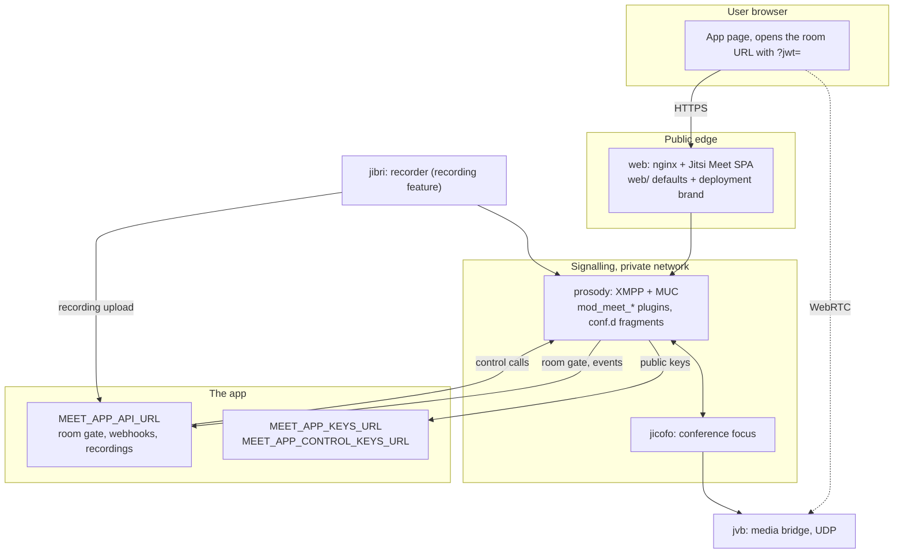
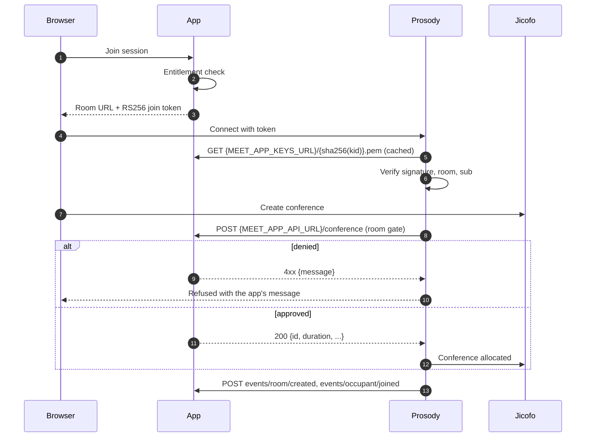

# Architecture

meet-service runs self-hosted Jitsi Meet for apps that need video rooms: an LMS, a telehealth portal, a community platform or an internal tool.
Each customer, product or environment runs its own deployment from the same code; one deployment never serves another's rooms.
Apps integrate through the versioned [app contract](../contract/README.md), so the service never needs to know which app it serves.

## Components

| Component | Source | What this repository adds |
|---|---|---|
| web, prosody, jicofo, jvb, jibri | Official `docker-jitsi-meet` images and compose files at `UPSTREAM_VERSION`, unmodified | Mounts and environment from `compose/` |
| Prosody plugins | `prosody/plugins/mod_meet_*.lua` | Events, privacy, control, single session |
| Prosody settings | `prosody/conf.d/*.cfg.lua` | Read every secret and per-deployment value from the environment |
| Recording hand-off | `services/recording-finalize/finalize.sh` | Jibri finalize script that uploads to the app |
| App proxy | `services/app-proxy/` + `compose/app-proxy.yml` | Optional nginx that lets Prosody reach an app on the docker host |
| Web | `web/` + `deployments/<name>/brand/` | Behaviour config, landing page, close page, branding |

Upstream is never patched or forked.
The plugins are mounted read-only into `/prosody-plugins-custom`, which upstream Prosody already searches first.

## Feature switches

Deployments differ only by settings, at three levels:

1. **Containers**, per deployment: `MEET_FEATURES` adds `compose/<feature>.yml` (and, for `recording`, upstream `jibri.yml`).
2. **Plugins and defaults**, per deployment: `MEET_PLUGINS` decides which `mod_meet_*` and upstream modules load; `scripts/meet` turns it into the upstream `XMPP_MODULES`, `XMPP_MUC_MODULES` and room gate settings.
3. **Room options**, per room: the join token's `context.room` block, bounded by levels 1 and 2.

| Switch | Values |
|---|---|
| `MEET_FEATURES` | `recording`, `app-proxy` |
| `MEET_PLUGINS` | `events`, `room-gate`, `control`, `single-session`, `privacy` |

Each switch has a page under [features/](features/).

## Two gates

Checking a user once, when the app mints the token, is not enough: a token minted before a session is cancelled still opens the room.
So there are two gates.

- **Room gate: may this room exist?** With `room-gate`, Prosody asks the app before a room opens.
  The app can refuse a cancelled session, a session outside its window or a tenant over quota.
- **Join token: may this person enter this room?** Prosody verifies the RS256 token on every join.

The room gate is what makes the app authoritative rather than advisory.

## Join flow

The room gate call happens once per room, so the first person in waits for it; later joins go straight through.

## Tenancy and isolation

- Rooms live at `{PUBLIC_URL}/{tenant}/{room}`; Prosody sees them as `[tenant]room`.
- The token's `sub` must match the tenant and `room` must match the room, so a stolen token is inert anywhere else.
- Room names must be unguessable (for example a UUID per session), never derived from a title or a code a user could guess.
- Signing uses RS256 with a `kid`; rotation publishes a new `kid` beside the old one.
- Each deployment has its own data directory, secrets and keys.

## Trust boundaries

| Boundary | Rule |
|---|---|
| Browser to edge | Untrusted; everything the client says is a claim to verify. |
| Edge to Prosody | Only the web container reaches Prosody. Its HTTP port binds to loopback by default (`MEET_CONTROL_BIND`). |
| Prosody to app | Server to server, `Authorization: Bearer MEET_APP_API_TOKEN`. Carries user data, so use TLS when it leaves the host. |
| App to Prosody | Control calls carry a token signed with a separate control key pair, never the join key pair. |
| Jibri to app | The finished recording, with the same bearer token. |

Never publicly expose Prosody's 5222, 5347 or 5280, Jicofo's REST port, JVB's 8080 or Jibri's API.
Only 80/443 and the JVB media port face the internet.

## Why a separate control key

`/kick-user`, `/allow-user` and `/end-meeting` verify their bearer against `MEET_APP_CONTROL_KEYS_URL`, not `MEET_APP_KEYS_URL`.
If the two key pairs were the same, any user could lift their own join token out of the browser and remove anyone from any room.
Keep the control private key on the app server only.

## Token lifetime

Jitsi reuses the original token when a client reconnects, so a token that expires after two minutes drops users after any network blip.
Set `exp` to the scheduled end plus a margin instead.
The security a short lifetime would buy comes from elsewhere: the token only works in its own room and tenant, it is bound to `context.user.id`, the room gate can refuse the room, and the app can remove the holder at any time.

## Attendance comes from the server

Room and participant webhooks come from Prosody, never from the browser, which can lie about who was present and for how long.
`room/destroyed` repeats every participant with join and leave times, so the app can repair events it missed.

## Operations

| Failure | Symptom | Response |
|---|---|---|
| Room gate endpoint down | No new rooms open; live rooms keep running | Keep the endpoint fast, dependency-light and highly available |
| No recorder free | Recording does not start | Scale Jibri (`scripts/meet up <name> --scale jibri=N`); tell the moderator clearly |
| App unreachable for webhooks | Events retried, then dropped | Reconcile from `room/destroyed` and the room gate `DELETE` |
| Upload keeps failing | Recording stays on the recorder | Re-run the finalize script by hand, see [features/recording.md](features/recording.md) |
